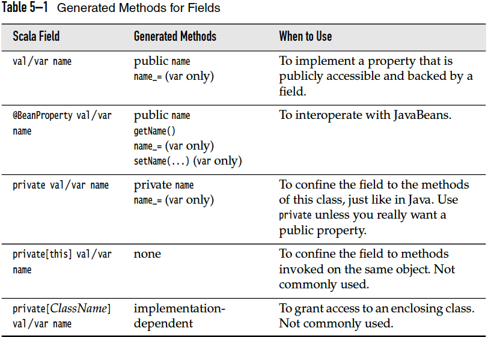

Ceylon vs. Kotlin vs. Scala Comparison
======================================

## Compile and Run
---------------

### REPL

**Kotlin**

    $ kotlinc-jvm -cp joda-time-2.9.4/joda-time-2.9.4.jar

**Ceylon**

    No support

**Groovy**

    $ groovysh

or GUI

    $ groovyConsole

**Scala**

    $ scala

### Scripting

**Kotlin**

    $ kotlinc -script <script_name> <parameters>

**Ceylon**

    No support

**Groovy**

    $ groovy <script>

### Compile and Run (without using Java directly)

**Kotlin**

    No support

**Ceylon**

    $ ceylon run --compile=force --run=hello default

or separatly in 2 steps:

    $ ceylon compile
    $ ceylon run --run=hello default    

### Running the program using plain Java

**Kotlin**

include run-time:

    $ kotlinc HelloWorld.kt -include-runtime -d HelloWorld.jar
    $ java -jar HelloWorld.jar

or without run-time:

    $ kotlinc HelloWorld.kt -d HelloWorld.jar
    $ java -cp $KOTLIN_HOME/lib/kotlin-runtime.jar:HelloWorld.jar HelloWorldKt

**Ceylon**

(run-time included or not?)

    $ ceylon fat-jar --run=hello default
    $ java -jar default.jar

### Compile to JavaScript


### Using Build tools


#### Gradle

#### Maven

### Using IDE


Basic syntax
------------

### Package/Module/Namespace Definition

<table>
      <thead>
                <tr>
                  <th> </th>
                  <th>Ceylon </th>
                  <th>Kotlin </th>
                  <th>Scala </th>
                </tr>
      </thead>
      <tbody>
                <tr>
                  <td>Package </td>
                  <td> </td>
                  <td>package my.demo // at the top of the file </td>
                  <td><pre><code>package com {
  package horstmann {
    package impatient {
      class Employee
      ...
    }
  }
}</code></pre><br>
<li>Chained Package</li>
<pre><code>package com.horstmann.impatient {
// Interim packages are not visible
package people {
class Person
...
}
}</code></pre><br>
<li>Top-of-File Notation</li>
<pre>package com.horstmann.impatient
package people
class Person
...</pre></td>
  </tr>
  <tr>
    <td>Imports </td>
    <td> </td>
    <td>import foo.Bar <br> import bar.Bar as bBar <br>import foo.* <br> <code>import &lt;other declarations&gt;</code> <br> <del>import static</del> </td>
    <td><code class="Scala">import java.awt._ // import all<br>
    import java.awt.{Color, Font} //import more than one member <br> 
    import java.util.{HashMap => JavaHashMap} // rename <br>
    import java.util.{HashMap => _, _} // hide HashMap <br></code>
    an import statement can be anywhere, The scope of the import statement extends until the end of the enclosing block</td>
  </tr>
  <tr>
    <td>Visibility </td>
    <td> </td>
    <td>// file name: example.kt <br> package foo <br> private fun foo() {} // visible inside example.kt <br> public var bar: Int = 5 // property is visible everywhere <br> private set // setter is visible only in example.kt <br> internal val baz = 6 // visible inside the same module </td>
    <td> </td>
  </tr>
      </tbody>
</table>
            
### Literals
|                      | Ceylon    | Kotlin      | Scala    |
| -------------------- | --------- | ----------- | -------- |
| String Literal       | "..."     | "..."       | "..."    |
| Char encoding        | UTF-32    |             |          |
| Verbatim(raw) String | """...""" | """..."""   | raw"..." |
| Boolean              |           | true, false |          |

#### String template(interpolation)
<table>
<tr>
  <td>Ceylon</td>
  <td><code>"Hello, this is Ceylon ``language.version`` on ``runtime.name`` ``runtime.version``!"</code></td>
</tr>
<tr>
  <td>Kotlin</td>
  <td><code>"${s1.replace("is", "was")}, but now is $a"</code></td>
  <td>Also usable in verbatim strings</td>
</tr>
<tr>
  <td>Scala</td>
  <td>
    <code class="scala">
      f"… $name…you’ll be ${age + 0.5}%7.2f years old.%n"<br>
      s"…${exp}…"
    </code>
  </td>
  <td></td>
</tr>
</table>

#### Number Literals
<table>
<tr>
  <td>Ceylon</td>
  <td>
    <code>Integer one = 1; <br/>
          Float zero = 0.0;
    </code>
  </td>
</tr>
<tr>
  <td>Kotlin</td>
  <td>
    <code class="scala">
      123 //Default to Int<br/>
      123456L <br/>
      12.34 // Default to Double <br/>
      12.34F <br/>
      0xAB <br/>
      0b11010010_01101001 <br/>
    </code>
  </td>
  <td>NO Octal literals</td>
</tr>
<tr>
  <td>Scala</td>
  <td><code></code></td>
  <td></td>
</tr>
</table>

#### Character Literals
<table>
  <tr>
    <td>Ceylon</td>
  </tr>
  <tr>
    <td>Kotlin</td>
    <td><code>'1',\t, \b, \n, \r, &#39;, &quot;, \ and \$, '\uFF00'</code></td>
    <td> - Char is NOT a number <br/> - boxed when a nullable reference is needed</td>
  </tr>
  <tr>
    <td>Scala</td>
    <td></td>
    <td></td>
  </tr>
</table>

### Comments, Case sensitivity, misc

|                       | Ceylon                                                                                                                                                                                                                                                           | Kotlin                                                                                   | Scala                                                                   |
| --------------------- | ---------------------------------------------------------------------------------------------------------------------------------------------------------------------------------------------------------------------------------------------------------------- | ---------------------------------------------------------------------------------------- | ----------------------------------------------------------------------- |
| Comment (Multiline)   | ``/* The classic Hello World program */``                                                                                                                                                                                                                        | ``/* This is a block comment on multiple lines. */``<br/> _Block comments can be nested_ |                                                                         |
| Comment (Single line) | //The classic Hello World program                                                                                                                                                                                                                                | // This is an end-of-line comment                                                        |                                                                         |
| Other comment         | `doc` annotation for declarations, and may contain _Markdown_ formatting<br/> `doc` ("The classic Hello World program")<br/>`by` ("Trompon the Elephant")<br/> `see` (\`function goodbye\`)<br/>`throws` (\`class IOException\`)<br/>shared void hello() { ... } |                                                                                          |                                                                         |
| ;                     | Needed                                                                                                                                                                                                                                                           | Optional, needed only when multiple exp/statements are on the same line                  | Optional, needed only when multiple exp/statements are on the same line |
| Case                  | Sensitive                                                                                                                                                                                                                                                        | Sensitive                                                                                | Sensitive                                                               |

### Identifier naming

|               | Ceylon                                        | Kotlin | Scala |
| ------------- | --------------------------------------------- | ------ | ----- |
| Type Name     | **must** start with an initial capital letter |        |       |
| Variable Name | **must** start with lowercase or underscore   |        |       |
| Function Name | **must** start with lowercase or underscore   |        |       |

### Variable declarations and primitive types

|                                    | Ceylon                                                                                              | Kotlin                                                                                                                                                                                                                                                                                                                                                                          | Scala                                                                                                     |
| ---------------------------------- | --------------------------------------------------------------------------------------------------- | ------------------------------------------------------------------------------------------------------------------------------------------------------------------------------------------------------------------------------------------------------------------------------------------------------------------------------------------------------------------------------- | --------------------------------------------------------------------------------------------------------- |
| Variable declaration               | immutability is the default, unless `variable`                                                      | `var`/`val`                                                                                                                                                                                                                                                                                                                                                                     | `val/var`                                                                                                 |
| Type inference                     | Yes: `value`                                                                                        | Yes                                                                                                                                                                                                                                                                                                                                                                             | Yes                                                                                                       |
| Primitive types are Objects        | Yes, will map basic types back to JVM primitives for performance reasons.                           | Yes, will map basic types back to JVM primitives for performance reasons.                                                                                                                                                                                                                                                                                                       | Yes, and even further: RichInt , RichDouble , RichChar , and so on                                        |
| Boxing and Unboxing                |                                                                                                     | Boxing of numbers preserves equality but does not neccessarily preserve identity:<br/><code>val boxedA: Int? = a<br/>val anotherBoxedA: Int? = a<br/>print(boxedA === anotherBoxedA) //false<br/>print(boxedA == anotherBoxedA) // true </code>                                                                                                                                 |                                                                                                           |
| Lazy Value                         | Yes                                                                                                 |                                                                                                                                                                                                                                                                                                                                                                                 | `lazy val words = scala.io.Source.fromFile("/usr/share/dict/words").mkString`                             |
| Numerical types                    | Integer(64), Float(64)                                                                              | Double(64), Float(32), Long(64), Int(32), Short(16), Byte(8)                                                                                                                                                                                                                                                                                                                    | Byte, Char, Short, Int, Long, Float, Double                                                               |
| (Explicit) Type conversion         | NO explicit widening: 0.float // 'float' is an attribute                                            | NOT implicitly converted to bigger types, Every number type supports the following conversions:<br/><ul><li><code>toByte(): Byte</code></li><li><code>toShort(): Short</code></li><li><code>toInt(): Int</code></li><li><code>toLong(): Long</code></li><li><code>toFloat(): Float</code></li><li><code>toDouble(): Double</code></li><li><code>toChar(): Char</code></li></ul> | implicit coverted if defined <br> explicit conversion: <br> `<type>.apply(value)` or `<type>(value)` <br> |
| String                             |                                                                                                     | immutable,<br/> iterable: for(c in str) { println(c) }),<br/> indexable: s[i]                                                                                                                                                                                                                                                                                                   |                                                                                                           |
| Nullable variable (Optional types) | String? name = process.arguments.first;                                                             | fun parseInt(str: String): Int? {...}                                                                                                                                                                                                                                                                                                                                           |                                                                                                           |
| Handling Nullable values           | String name = !arg.trimmed.empty `then` arg `else` "World";<br/>Integer length = name?.size else 0; |                                                                                                                                                                                                                                                                                                                                                                                 |                                                                                                           |

### Operators, Expression and Statement

|                       | Ceylon | Kotlin | Scala                                                      |
| --------------------- | ------ | ------ | ---------------------------------------------------------- |
| operators are methods |        |        | Yes                                                        |
| overloading operators |        |        | Yes                                                        |
| Block expression      |        |        | The value of the block is the value of the last expression |

### Control Structures

<table>
              <thead>
                <tr>
                  <th> </th>
                  <th>Ceylon </th>
                  <th>Kotlin </th>
                  <th>Scala </th>
                </tr>
              </thead>
              <tbody>
                <tr>
                  <td>braces </td>
                  <td><strong>CANNOT</strong> be omitted </td>
                  <td> </td>
                  <td> </td>
                </tr>
                <tr>
                  <td>if&hellip;else </td>
                  <td>if(exp1) {&hellip;}<br/>else if(exp2) {&hellip;}<br/>else {&hellip;} </td>
                  <td>see <code>if</code> expression below </td>
                  <td><code>if...else</code> expression </td>
                </tr>
                <tr>
                  <td>switch </td>
                  <td>NO fall-through behavior<br/>switch (exp)<br/>case (val1) {&hellip;}<br>case (val2) {&hellip;}<br/>else {&hellip;} </td>
                  <td>see <code>when</code> expression below </td>
                  <td>No </td>
                </tr>
                <tr>
                  <td>Assert </td>
                  <td>&ldquo;customized assert msg&rdquo;<br/> assert(cond1, cond2,..) </td>
                  <td> </td>
                  <td> </td>
                </tr>
                <tr>
                  <th>for loop</th>
                  <td title="Ceylon">
                    <code>for (var in <iterable> ) {&hellip;} else {&hellip;} </code><br/>
		    for (i in min:len) {&hellip;} <br/> 
		    for (i in min..max) {&hellip;} <br/> 
		    <strike> for (&hellip;;&hellip;;&hellip;)</strike> 
                  </td>
                  <td title="Kotlin">for (item in items) { println(item) } </td>
                  <td title="Scala"><code> 
			for ( variable <- expression if cond) {&hellip;} <br>
			for ( var1 <- exp1; definition; var2 <- exp2; &hellip; ) {&hellip;} <br>
			for ( generator ) <code>yield</yield> expr // for comprehension <br>
			for { generator/cond/definition } {&hellip;} // braces OK </code>
		          </td>
                </tr>
                <tr>
                  <th>while </th>
                  <td>while (cond) {&hellip;} </td>
                  <td>while (index &lt; items.size) {<br/>println(&ldquo;item at $index is ${items[index]}&rdquo;)<br/>index++<br/>} </td>
                  <td></td>
                </tr>
                <tr>
                  <th>do&hellip;while </th>
                  <td>No </td>
                  <td>do { <br> val y = retrieveData() <br> } while (y != null) // y is visible here! </td>
                  <td> </td>
                </tr>
                <tr>
                  <th>Exception(try/catch/finally)</th>
                  <td>like Java&rsquo;s but no checked exceptions </td>
                  <td> </td>
                  <td title="Scala"> no “checked” exceptions, No try-with-resources 
                  <pre><code class="Scala">val url = new URL("http://horstmann.com/fred-tiny.gif")
try {
   process(url)
} catch {
   case _: MalformedURLException => println(s"Bad URL: $url")
   case ex: IOException => ex.printStackTrace()
} finally {
   url.close()
}</code></pre> A <code>throw</code> expression has the special type Nothing
                  </td>
                </tr>
                <tr>
                  <th>Condition lists </th>
                  <td>A condition list is simply an ordered list of :<br/> - <code>boolean</code> exp<br/> - <code>exists</code> conditions<br/> - <code>nonempty</code> conditions<br/> - <code>is</code> conditions<br/> - negated forms of the above<br/>Condition lists can be used in <code>if</code>, <code>switch</code>, <code>while</code>, <code>assert</code>, comprehensions, and <code>if and switch expressions</code> </td>
                  <td> </td>
                  <td> </td>
                </tr>
                <tr>
                  <th>if, switch/when expressions </th>
                  <td>an &ldquo;inline&rdquo; if or switch within an expression, branches of an if or switch expression are always just expressions, never blocks of code! </td>
                  <td>fun maxOf(a: Int, b: Int) = <code>if (a &gt; b) a else b</code><br/>fun describe(obj: Any): String =<br/><code>when</code> (obj) {<br/>1 -&gt; &ldquo;One&rdquo;<br/>&ldquo;Hello&rdquo; -&gt;&ldquo;Greeting&rdquo;<br/>is Long -&gt; &ldquo;Long&rdquo;<br/>!is String -&gt; &ldquo;Not a string&rdquo;<br/>else -&gt; &ldquo;Unknown&rdquo;<br/>} </td>
                  <td> </td>
                </tr>
                <tr>
                  <th>label </th>
                  <td> </td>
                  <td><code>label@</code> </td>
                  <td> </td>
                </tr>
              </tbody>
</table>

### Function Declaration

<table>
  <thead>
    <tr>
      <th> </th>
      <th>Ceylon </th>
      <th>Kotlin </th>
      <th>Scala </th>
    </tr>
  </thead>
  <tbody>
    <tr>
      <th>Function declaration</th>
      <td title="Ceylon"> Float sqr(Float x) { return x * x; } </td>
      <td title="Kotlin">
        <code class="Kotlin">fun sum(a: Int, b: Int): Int { return a + b }</code> <br/>
        <code class="Kotlin">fun sum(a: Int, b: Int) <code>=</code> a + b //return type inferred</code><br/>
      </td>
      <td title="Scala">
    <pre>
<code class="Scala">def fac(n : Int) = {
    var r = 1
    for (i <- 1 to n) r = r * i
    r
}</code></pre>
        - return type can be inferred except for case of recursive functions <br>
        - return value is the last expr in the block  
     </td>
    </tr>
    <tr>
          <th>Void return value</th>
          <td title="Ceylon"> void hello(String name=&ldquo;World&rdquo;) {&hellip;} </td>
          <td title="Kotlin">  <code>Unit</code> : no return value and can be omitted </td>
          <td title="Scala">
            <pre><code class="Scala">def box(s : String): Unit = {
                 ...
}
def box(s : String) { // no <em>=</em>
    ...
}</code></pre>
          </td>
        </tr>
    <tr>
      <th>Default parameters</th>
      <td title="Ceylon"> void hello(String name=&ldquo;World&rdquo;) {&hellip;} </td>
      <td title="Kotlin"></td>
      <td title="Scala"></td>
    </tr>
    <tr>
      <th>Lambda</th>
      <td title="Ceylon"><code>String name =&gt; firstName + &quot; &quot; + lastName;</code><br/><code>Float sqr(Float x) =&gt; x*x;</code></td>
      <td title="Kotlin"> -> </td>
      <td> </td>
    </tr>
  </tbody>
</table>

#### Named arguments
**Ceylon**

Braces are used as delimiters instead of parentheses, arguments are separated by semicolons.

```Ceylon
    printf {
        to = writer;
        format = "Thanks, %s. You have been charged %.2f. 
              Your confirmation number is %d.";
        values = { user.name, order.total, order.confimationNumber };
    };
```   

or leave out the parameter name and the braces surrounding the iterable construction expression.

```Ceylon
    printf {
        writer;
        "Thanks, %s. You have been charged %.2f. 
        Your confirmation number is %d.";
        user.name, order.total, order.confimationNumber
    };
```

**Kotlin**

**Scala**

#### Variable argument list (Variadic methods)

**Ceylon**

```Ceylon
    void helloEveryone(String* names) {...} 
    void helloEveryone(String+ names) {...} //_nonempty_ variadic params
```

3 ways to pass arguments to a variadic parameter

* provide an explicit list of enumerated arguments
* pass an iterable object producing the arguments, i.e spread operator (*args)
* specify a comprehension.

**Kotlin**

```Kotlin
fun listOf<T>(vararg values: T): List<T> { ... }
```
a __spread operator(*args)__ is needed to explicitly unpack the arguments you need to pass 

**Scala**

```Scala
    def sum(args: Int*) = {
      var result = 0
      for (arg <- args) result += arg
        result
    val s = sum(1 to 5 :_*) // Consider 1 to 5 as an argument sequence
```

#### Infix call

**Ceylon**

No (entry construction operator: ```->```)

**Kotlin**
    
    infix fun Any.to(other: Any) = Pair(this, other) // 1 to "one"

**Scala**

    5.+(3); 5 + 3 
    (1 to 5) map (_*2)

### Class Definition
#### General
|                  | Ceylon                                       | Kotlin                                     | Scala                    |
| ---------------- | -------------------------------------------- | ------------------------------------------ | ------------------------ |
| Definition       | class \<id> {…}                              | class \<id> {...}                          | class \<id> {...}        |
| omitable {}?     | No                                           | Yes                                        | Yes                      |
| Instantiation    | No `new`                                     | No `new`                                   | `new` or `.apply` method |
| Member variables | Attribute                                    | No field, only Properties                  |                          |
| Overloading      | No(defaulted/varargs/union/enumerated types) |                                            |                          |
| Static members   | barely used(toplevel declarations)           | No static methods(package-level functions) |                          |
| Type Alias       |                                              |                                            |                          |

#### Visibility
**Ceylon** doesn't make a distinction between public, protected and "default" visibility like Java does; Instead, the language distinguishes between:
- program elements which are visible only inside the scope in which they are defined, and
- program elements which are visible wherever the thing they belong to (a type, package, or module) is visible.

By default, members are hidden from code outside the body of the class. Annotated by the  `shared` annotation, member is visible to any code to which the class itself is visible.

`shared` top level classes are visible to any code to which the containing package is visible.

`shared` packages are visible outside of the module to which the package belongs.
>the `restricted` annotation can be used to narrow the visibility of a shared declaration. 

**Kotlin** visibility modifiers

| Modifier         | Class member          | Top-level declaration |
| ---------------- | --------------------- | --------------------- |
| public (default) | Visible everywhere    | Visible everywhere    |
| internal         | Visible in a module   | Visible in a module   |
| protected        | Visible in subclasses | ---                   |
| private          | Visible in a class    | Visible in a file     |

>The default visibility in Java, package-private, isn’t present in Kotlin. Kotlin uses
packages only as a way of organizing code in namespaces; not for visibility control. With Java, the encapsulation can be easily broken, because external code can define classes in the same packages used by your code and thus get access to your package-private declarations. Kotlin's `internal` visibility can provides real encapsulation for the implementation details of your module. But `internal` becomes `public` when compiled into the bytecode, with __mangled__ member names.(Ref. KIA p74) 

>Kotlin allows the use of `private` visibility for top-level declarations, including classes, functions, and properties. `private` class is compiled to a package-private declaration in bytecode.

>In Java, you can access a protected member from the same package, but in Kotlin, a `protected` member is only visible in the class and its subclasses. 

>Also note that extension functions of a class don’t get access to its `private` or `protected` members.

>In Kotlin, an outer class doesn’t see private members of its inner (or nested) classes.

**Scala**
Members are public by default. Use the `private` access modifier to hide them from outside of the class.
<tr>
  <td title="Scala"><li>private[...]</li><li>protected[...]</li> </td>
</tr>

```Scala
class Counter {
  private var value = 0 // You must initialize the field
  def increment() { value += 1 } // Methods are public by default
  def current() = value
}
```

#### Class Initialization and Constructors 

**Ceylon**

An _initializer_ parameter list is used to instantiate a class, those parameters are right after the class name. Logic to initialize the values of attributes of a class, _initializer_, is written directly in the body of the class.

When a reference is annotated `late`, the checks which normally happen at compile time are delayed until runtime. Certain widely-used Java frameworks depend on direct reflection-based access to initialize the fields of annotated classes. You'll probably need to annotate it `late` in order to suppress the compile-time initialization checks.

A class with initializer parameters can't have constructors, so if we need to add a constructor to a class, the first thing we need to do is rewrite it without initializer parameters.

_Default constructors_ are declared using `new` only.

```ceylon
"A polar coordinate"
class Polar {

  shared Float angle;
  shared Float radius;

  shared new (Float angle, Float radius) {
    this.angle = angle;
    this.radius = radius;
  }

  ...
}

print(Polar(0.37, 10.0));
```

A _named constructor_ declaration looks just like a default constructor, except that it declares an initial-lowercase name:

```ceylon
"A polar coordinate"
class Polar {

    shared Float angle;
    shared Float radius;

    shared new (Float angle, Float radius) {
        this.angle = angle;
        this.radius = radius;
    }

    shared new copy(Polar polar) {
        this.angle = polar.angle;
        this.radius = polar.radius;
    }

  ...
}
```
A reference to a named constructor must be qualified by the class name, except within the body of the class itself:

```ceylon
value pt = Polar(0.37, 10.0);
print(Polar.copy(pt));
```
A constructor may delegate:

- to another constructor of the class, whose declaration occurs earlier in the body, or
- directly to a constructor of its superclass or to the initializer of its superclass, if any.

Constructor delegation is specified using `extends`:

```ceylon
"A polar coordinate"
class Polar {

    shared Float angle;
    shared Float radius;

    shared new (Float angle, Float radius) {
        this.angle = angle;
        this.radius = radius;
    }

    shared new copy(Polar polar)
        extends Polar(polar.angle, polar.radius) {}

    shared new onHorizontalAxis(Float distance)
        extends Polar(0.0, distance) {}

  ...
}
print(Polar.onHorizontalAxis(1.0));
```

A _partial constructor_ allows multiple constructors of a class to shared part of the initialization logic. A partial constructor:
- is not required to leave every member of the class initialized, 
- may only be called from the `extends` clause of another constructor of the _same_ class, and,
- therefore, may _not_ be declared `shared` and must be annotated `abstract`:

```ceylon
class Point {
    shared Float x;
    shared Float y;
    shared String label;

    //partial constructor
    abstract new xy(Float x, Float y) {
        this.x = x;
        this.y = y;
    }

    //default constructor
    shared new (Float x, Float y) 
            extends xy(x, y) {
        label = "";
    }

    //named constructor
    shared new withLabel(Float x, Float y, String label) 
            extends xy(x, y) {
        this.label = label;
    }
}
```
A _value constructor_ is a constructor that takes no parameters, and is executed exactly once for the context to which the class belongs.

```ceylon
"A polar coordinate"
class Polar {

  shared Float angle;
  shared Float radius;

  shared new (Float angle, Float radius) {
      this.angle = angle;
      this.radius = radius;
  }

  shared new copy(Polar polar)
      extends Polar(polar.angle, polar.radius) {}

  shared new onHorizontalAxis(Float distance)
      extends Polar(0.0, distance) {}

  shared new origin extends onHorizontalAxis(0.0) {}

  ...
}

print(Polar.origin);
print(Polar.onHorizontalAxis(1.0));
```
According to the language spec, an `object` actually is a value constructor!

> Initialization always flows from top to bottom, allowing the typechecker to verify that every value is initialized before it is used.

**Kotlin**
      
_Primary constructor_:

```Kotlin
class Person constructor(firstName: String) {…}
class Person(firstName: String) {…}
class Customer public @Inject constructor(name: String) { … }
```

A private constructor prevents it being instantiated by other code, but callable in companion objects

```kotlin
class Secretive private constructor() {} 
```

The primary constructor cannot contain any code. Initialization code can be placed in initializer blocks, which are prefixed with the `init` keyword:

```kotlin
class InitOrderDemo(name: String) {
    val firstProperty = "First property: $name".also(::println)

    init {
        println("First initializer block that prints ${name}")
    }

    val secondProperty = "Second property: ${name.length}".also(::println)

    init {
        println("Second initializer block that prints ${name.length}")
    }
}
```

You have to explicitly invoke the constructor of the superclass even if it doesn’t have any parameters:

```kotlin
open class Button //The default constructor without arguments is generated.
class RadioButton: Button()
```

_Secondary constructor_:
The majority of situations where you’d need overloaded constructors in Java are covered by Kotlin’s support for default parameter values and named argument syntax. But there are still situations when multiple constructors are required. The most common one comes up when you need to extend a framework class that provides multiple constructors. 

A secondary constructor is introduced using the `constructor` keyword:

```kotlin
class Person {
    constructor(parent: Person) {
        parent.children.add(this)
    }
}
```
You can call superclass constructors:

```kotlin
  constructor(ctx: Context) : super(ctx) { ... }
```

Or delegates to another constructor of the class:

```kotlin
  constructor(ctx: Context): this(ctx, MY_STYLE) { ... }
  constructor(ctx: Context, attr: AttributeSet): super(ctx, attr) { ... }
```
> If the class has no primary constructor, the delegation to primary constructor still happens _implicitly_, and the initializer blocks(which is part of the primary constructor) are still executed (in order from top to down). While in Scala, explicit calling `this()` is needed.

> If the class has no primary constructor, then each secondary constructor has to initialize
the base class or delegate to another constructor that does so.

**Scala**

_Primary constructor_:
In Scala, the primary constructor is the entire body of the class. Any parameters that the constructor requires are listed after the class name.

```Scala
class Person(val name: String, val age: Int) {
  println("Just constructed another person") // this line is part of primary constructor

  def description = s"$name is $age years old"
}
```
> - Only the primary constructor can call a superclass constructor.
> - You can never call super(params)
> - When extending a Java class, the primary constructor must invoke one of the constructors of the Java superclass

_Secondary constructors_:
An auxiliary constructor is named `this` and it must call the primary constructor
or another auxiliary constructor as its first expression. The compiler also requires
that the constructor called is one that appears earlier in the source code. So, we
_must order secondary constructors carefully_ in our code.

```Scala
class Person {
  private var name = ""
  private var age = 0

  def this(name: String) { // An auxiliary constructor
    this() // Calls primary constructor
    this.name = name
  }

  def this(name: String, age: Int) { // Another auxiliary constructor
    this(name) // Calls previous auxiliary constructor
    this.age = age
  }
}
```    
You can often eliminate auxiliary constructors by using default arguments in the primary constructor:

```scala
  class Person(val name: String = "", val age: Int = 0)
```
See <a href="#scala_primary_constructor_params">Table</a>

<div id="scala_primary_constructor_params">Scala Generated fields and methods for primary constructor parameters</div>

[Scala Primary Constructor Parameters](scala_primary_constructor_params.png)

#### object/Anonymous Class

**Ceylon**
```ceylon
object name extends … satisfies … {…} 
```
> Use \I_name_ to refer to the type of the object

- A toplevel object declaration does indeed define a singleton.<br>
- when nested inside a class defines an object per instance of the containing class.<br>
- nested inside a method, getter, or setter results in a new object each time the method, getter, or setter is executed.

**Kotlin**

**Scala**
```scala
object Accounts {
  private var lastNumber = 0
  def newUniqueNumber() = { lastNumber += 1; lastNumber }
}
```
- An `object` can extend a class and/or traits
- `object`s returned by a function are different instances

#### Companion objects
**Kotlin**
declare a companion object inside your class, call its members using only the class name as a qualifier.

**Scala**
the class and its companion obj must be located in the same source file

```scala
class Account {
...
}

object Account { // The companion object
  private var lastNumber = 0
  private def newUniqueNumber() = { lastNumber += 1; lastNumber }
}
```

#### Abstract class
**Ceylon**
```ceylon
abstract class Point() {
  shared formal Polar polar;
  ...
}
```

**Kotlin**
```kotlin
abstract class Derived : Base() {
  override abstract fun f()
}
```

**Scala**
```scala
abstract class Person(val name: String) {
  def id: Int // No method body—this is an abstract method
}
```
- Do not use the abstract keyword for an abstract method, simply omit its body
- An abstract field is simply a field without an initial value.
- no override keyword is required in the subclass when you define a method/field that was abstract in the superclass.

#### Member/Nested/Inner class

| Class A declared within another class B                     | Java           | Kotlin        |
| ----------------------------------------------------------- | -------------- | ------------- |
| Nested class (doesn’t store a reference to an outer class) | static class A | class A       |
| Inner class (stores a reference to an outer class)          | class A        | inner class A |

**Ceylon**: A non-abstract nested class declaration is called a _member class_ of the class/interface. A nested interface or abstract class declaration is not part of the schema of the class/interface type, and is therefore not considered a member of the class/interface. _Member class can be refined(overrided)_ in Ceylon, akin to the "factory method" pattern of many other languages.

```Ceylon
class BufferedReader(Reader reader) satisfies Reader {

    shared default class Buffer()
            satisfies List<Character> { ... }
    ...
}
```
The member class Buffer is annotated shared, so we can instantiate it like this:

```Ceylon
BufferedReader br = BufferedReader(ExampleReader());
BufferedReader.Buffer b = br.Buffer();
```
Note that a nested type name must be qualified by the containing type name when used outside of the containing type.

The member class Buffer is also annotated default, so we can refine it in a subtype of BufferedReader:

```Ceylon
class BufferedFileReader(File file)
        extends BufferedReader(FileReader(file)) {
    shared actual class Buffer()
            extends super.Buffer() { ... }
    ...     
}
```

**Kotlin** Nested classes don't have access to the outer class instance (the same as a `static` nested class in Java), unless you specifically request that by `inner`.

```Kotlin
class Outer {
  inner class Inner {
    fun getOuterReference(): Outer = this@Outer
  }
}
```

**Scala**
In Scala, inner classes are bound to the outer object. A member class is instance-specific: `instance1.Member` and `instance2.Member` are different classes.
Use `#` with outer class name: `OuterClass#InnerClass`.

#### Sealed Class
**Ceylon**
`sealed` specifies that a class/interface/constructor may not be extended or instantiated outside the _module_ in which it is defined.
A class with no parameter list may not be annotated sealed.

Enumerated types: TODO

**Kotlin** 
subclasses must be declared in _the same file_ as the sealed class itself. (Before Kotlin 1.1, subclasses had to be nested inside the sealed class).
A sealed class is `open` and `abstract` by default, it cannot be instantiated directly and can have abstract members. Sealed classes are not allowed to have non-private constructors (their constructors are private by default).
Interface cannot be `sealed`.

```Kotlin
sealed class Expr
data class Const(val number: Double) : Expr()
data class Sum(val e1: Expr, val e2: Expr) : Expr()
object NotANumber : Expr()
```
The key benefit of using sealed classes: when you use them in a `when` expression, it's possible to verify that the statement covers all cases, you don't need to add an `else` clause to the statement. However, this works only if you use `when` as an expression and not as a statement.

```Kotlin
fun eval(expr: Expr): Double = when(expr) {
    is Const -> expr.number
    is Sum -> eval(expr.e1) + eval(expr.e2)
    NotANumber -> Double.NaN
    // the `else` clause is not required because we've covered all the cases
}
```
**Scala** The sealed modifier applies to class definitions. A sealed class may not be directly inherited, except if the inheriting template is defined in _the same source file_ as the inherited class. However, subclasses of a sealed class can be inherited anywhere.

```scala
sealed abstract class Option[+A] ... { ... }
```
A key point about `Option` is that there are really only two valid subtypes. Either we have a value, the `Some` case, or we don’t, the `None` case. There are no other subtypes of Option that would be valid.

When pattern matching on an instance of a sealed base class, the match is _exhaustive_ if the case clauses cover all the derived types defined in the same source file.

#### Case class (Scala) And Data class (Kotlin)
**Kotlin**
```kotlin
data class User(val name: String, val age: Int)
```
The compiler automatically derives the following members from all properties declared in the primary constructor:
- `equals` for comparing instances
- `hashCode` for using them as keys in hash-based containers such as HashMap
- `toString` for generating string representations showing all the fields in declaration order
- `componentN()` functions corresponding to the properties in their order of declaration
- `copy()` function 

> Note that properties that aren't declared in the primary constructor don't take part in the equality checks and hash code calculation, hence to exclude a property from the generated implementations, declare it inside the class body.

> it's strongly recommended that you use only read-only properties, making the instances of the data class _immutable_.

> `componentN()` functions generated for data classes enable their use in destructuring declarations:
 `val jane = User("Jane", 35); val (name, age) = jane`

**Scala**

Case classes are good for modeling immutable data.
```scala
case class Book(isbn: String)

val frankenstein = Book("978-0486282114")
```
- Case classes have an `apply` method generated in the companion object, keyword `new` was not used to instantiate the case class. 
- Case classes have an `unapply` method generated in the companion object, so can be used in the extractor pattern matching.
- The parameters are public `val`s, It is possible to use `var`s but this is discouraged.
- Case classes are compared by structure and not by reference.
- You can create a (shallow) copy of an instance of a case class simply by using the copy method. You can optionally change the constructor arguments.
- Every case class implicitly overrides some method definitions of class `scala.AnyRef` unless a definition of the same method is already given in the case class itself or a concrete definition of the same method is given in some base class of the case class different from AnyRef. In particular: `equals`, `hashCode` and `toString`.

#### Class delegation
**Kotlin**
The _Delegation pattern_ has proven to be a good alternative to implementation inheritance, and Kotlin supports it natively requiring zero boilerplate code by using `by` keyword.

#### Properties/Attributes

<table>
  <thead>
    <tr>
      <th> </th>
      <th>Ceylon </th>
      <th>Kotlin </th>
      <th>Scala </th>
    </tr>
  </thead>
  <tbody>
    <tr>
      <td>Property </td>
      <td>Attributes with getter/setter </td>
      <td> </td>
      <td> </td>
    </tr>
    <tr>
      <td>Property Init </td>
      <td>specify the value when declaring it or directly in the body of the class </td>
      <td>non-null properties must be initialized in the constructor</td>
      <td> </td>
    </tr>
    <tr>
      <td>Backing field </td>
      <td> </td>
      <td>using the `field` identifier, generated if default implementation of accessors is used or `field` identifieris referenced </td>
      <td> </td>
    </tr>
    <tr>
      <th>late prop?</th>
      <td>Yes</td>
      <td>Yes, `lateinit`</td>
      <td></td>
    </tr>
    <tr>
      <th>lazy prop?</th>
      <td>Yes</td>
      <td>Yes</td>
      <td>Yes</td>
    </tr>
    <tr>
      <th>Overridable</th>
      <td>Yes</td>
      <td>Yes</td>
      <td>Yes</td>
    </tr>    
  </tbody>
</table>

<div id="scala_generated_methods_for_fields">Scala generated methods for fields</div>  



#### Custom Getter and Setter

**Ceylon**
```ceylon
shared String fullName => … 
assign fullName {…} 
```
> A setter may not be annotated shared, default or actual. The visibility and refinement modifiers of an attribute with a setter are specified by annotating the matching getter.

**Kotlin**
```kotlin
var/val <propName>[: <PropType>] [=<initializer>]
  get() = … 
  set(value) {…} 
```
> Overriding properties works in a similar way to overriding methods. You can also override a val property with a var property, but not vice versa.

**Scala**
```scala
private var privateAge = 0 // backing field
def age = privateAge
def age_=(newValue: Int) {
  privateAge = newValue; 
}

@BeanProperty val/var name //Interop with JavaBeans
```

See <a href="#scala_generated_methods_for_fields">Table</a>

#### Extensions

|                    | Ceylon | Kotlin                                                                                                                                       | Swift                                            | Scala |
| ------------------ | ------ | -------------------------------------------------------------------------------------------------------------------------------------------- | ------------------------------------------------ | ----- |
| Extension Function |        | `fun <receiver type>.<function decl.> {...}` <br> - Extensions are resolved *statically* <br> - can be defined with a nullable receiver type | `extension` SomeType: Protocol1, Protocol2 {...} |       |
| Extension Property |        | `val <receiver type>.<prop decl.>: <type> get() = ... set() = ...` <br> initializers are not allowed for extension properties.               |                                                  |       |
| companion Obj Ext. |        | fun MyClass.Companion.foo() { ...                                                                                                            |                                                  |       |

### Interface(Trait) Definition
#### Declaration
**Ceylon**

```Ceylon
interface Writer {
  shared formal Formatter formatter;
  shared formal void write(String string);
  shared void writeLine(String string) {
    write(string);
    write("\n");
  }
}
```
Interface members can be concrete methods, attribute getters/setters, but NO references or init logic

**Kotlin**

```Kotlin
interface MyInterface {
  val prop: Int // abstract
  val propertyWithImplementation: String
        get() = "foo"

  fun bar()
  fun foo() {
    print(prop)
  }
}
```
Interface members can be 
- abstract methods 
- method implementation 
- abstract props 
- accessors 

**Scala**

```Scala
trait Comparable[T <: Comparable[T]] { self: T =>
  def < (that: T): Boolean
  def <=(that: T): Boolean = this < that || this == that
  def > (that: T): Boolean = that < this
  def >=(that: T): Boolean = that <= this
}
```
>In Scala, you can initialize fields, as well as methods and types, in the body of the trait. Subsequent traits or classes in the linearization can override these definitions. But this is not allowed in Ceylon or Kotlin.

### Inheritance and Overriding(Refinement)

#### Summary
|                      | Ceylon         | Kotlin        | Scala                |
| -------------------- | -------------- | ------------- | -------------------- |
| Inherit a class      | extends        | :             | extends              |
| Inherit an interface | satifies       | :             | extends ... with ... |
| Override             | default/actual | open/override | override(optional)   |
| Single Inheritance   | Yes            | Yes           | Yes                  |

#### Inherit a class and override members
**Ceylon**
By default, classes are extensible. Ceylon forces us to declare attributes or methods that can be refined (overridden) by annotating them `default`, and to declare that an attribute or method refines (overrides) an attribute or method of a superclass by annotating it `actual` (not "overrides" which is a verb and doesn't read well when combined with other annotations which are all adjectives).

```Ceylon
"A polar coordinate"
class Polar(Float angle, Float radius) {
           
    shared Polar rotate(Float rotation)
            => Polar(angle+rotation, radius);
    
    shared Polar dilate(Float dilation)
            => Polar(angle, radius*dilation);
    
    "The default description"
    shared default String description
            => "(``radius``,``angle``)";

}
          
"A polar coordinate with a label"
class LabeledPolar(Float angle, Float radius, String label)
        extends Polar(angle, radius) {

    "The labeled description"
    shared actual String description
            => label + "-" + super.description;

}

"A coordinate-system free abstraction of a geometric point"
abstract class Point() {

  shared formal Polar polar;
  shared formal Cartesian cartesian;

  shared formal Point rotate(Float rotation);
  shared formal Point dilate(Float dilation);
}
```
>Shortcut syntax for refinement:  `description => label + ": " + super.description;` , but this shortcut syntax does not allow annotations or documentation. 

**Kotlin**'s classes and methods are `final` by default, you need to mark the class with `open` to allow subclassing, and need to add the `open` modifier to every property or method that can be overridden. Interface members and abstract methods in abstract class are `open` by default. If you override a member of a base class or interface, the overriding member will also be `open` by default, unless you explicitly mark the overriding member as `final`.

| Modifier   | Corresponding member                    | Comments                                           |
| ---------- | --------------------------------------- | -------------------------------------------------- |
| `final`    | Can’t be overridden                    | By default for class members                       |
| `open`     | Can be overridden                       | Should be specified explicitly                     |
| `abstract` | Must be overridden                      | Used only in abstract classes                      |
| `override` | Overrides a superclass/interface member | Overridden member is `open`, unless marked `final` |

```Kotlin
interface Clickable {
    fun click() {}
    fun showOff() = println("I'm clickable!")
}

open class RichButton : Clickable {
  fun disable() {}  // final: you can’t override it in a subclass.

  open fun animate() {} // open: you may override it in a subclass

  override fun click() {} // This overrides an open function and
                          // is open as well.
}

abstract class Animated {
  abstract fun animate() // no implementation, must be overridden.
  
  open fun stopAnimating() {  // Non-abstract functions aren’t open,
  }                           // but can be marked as open.
  fun animateTwice() {}
}
```
**Scala**
By default, classes are inheritable and class members are overridable unless marked as `final`.

```Scala
class Employee extends Person {
  var salary = 0.0
  ...
  override def toString = s"${getClass.getName}[name=$name]"
}
```
- `final` class cannot be extended.
- `final` methods or fields cannot be overridden
- Invoke a superclass method by `super`
- `override` is optional when overriding an abstract field, but mandatory when overriding a concrete field.

#### Implement/Satisfy/Mix-in an interface/Trait 
**Ceylon**

```Ceylon
interface Clickable {
	shared formal String label;
	shared formal void click();

}

class Button() satisfies Clickable [& interface2 ...] {
	shared actual String label = "Button"; // Or simply: str = "Clicks";
	shared actual void click() => print("``label``: I was clicked"); // Or simply: click() => print("I was clicked");
}
```

**Kotlin**

```Kotlin
class C() : A(), B {
  override fun bar() {…}
}
```
Use `:` for both `extends` and `implements/satifies`, using `override` is mandatory.

**Scala**

```Scala
class Classname(params) extends Parent with iface {
  [override] def func = {...}
}
```
Keyword `override` is mandatory for member definitions or declarations that override some other _concrete_ member definition in a parent class.

#### Ambiguities in mixin inheritance

| Ceylon            | Kotlin           | Scala           |
| ----------------- | ---------------- | --------------- |
| (super of A).func | super\<A>.func() | super[A].func() |

**Kotlin**
```Kotlin
open class A {
  open fun f() { print("A") }
  fun a() { print("a") }
}

interface B {
  fun f() { print("B") } // interface members are 'open' by default
  fun b() { print("b") }
}

class C() : A(), B {
  // The compiler requires f() to be overridden:
  override fun f() {
    super<A>.f() // call to A.f()
    super<B>.f() // call to B.f()
  }
}
```

### Type system

|                    | Ceylon  | Kotlin | Scala               |
| ------------------ | ------- | ------ | ------------------- |
| Common super class | `Basic` | `Any`  | `AnyRef`/`AnyValue` |


### Type check and cast

|            | Ceylon                    | Kotlin | Swift | Scala |
| ---------- | ------------------------- | ------ | ----- | ----- |
| Type check | `is`, `exist`, `nonempty` | `is`   |       |       |
| Type cast  | `if (is ... )`            |        |       |       |

### Data Structure - Collections

#### Streams/Iterables

|                    | Ceylon                                                                                                                                                                                                      | Kotlin | Swift | Scala |
| ------------------ | ----------------------------------------------------------------------------------------------------------------------------------------------------------------------------------------------------------- | ------ | ----- | ----- |
| Literals and decl. | {String+} words = { "hello", "world" }; <br> {String+} moreWords = { "hola", "mundo", `*words` };                                                                                                           |        |       |       |
| Types              | {X*} := `Iterable<X,Null>` <br> {X+} := `Iterable<X,Nothing>`                                                                                                                                               |        |       |       |
| Containing test    | `in`                                                                                                                                                                                                        |        |       |       |
| Iterating          | for (word in moreWords) {...} <br> for (i -> word in moreWords.indexed) {...} <br> for (name -> place in zipEntries(names,places)) {...}                                                                    |        |       |       |
| Laziness           | Yes, <br> - Elements are not evaluated until the stream is iterated, <br> - Each element is reevaluated each time the stream is iterated. <br> - Use _sequence_ [...] or `.follow()` for eagerly evaluation |        |       |       |
| value equality     | == operator is not considered a well-defined operation for streams <br> use sequence [] or `set {...}` instead                                                                                              |        |       |       |

#### Sequences/Arrays

|                        | Ceylon                                                                                                                 | Kotlin | Swift | Scala                                                                        |
| ---------------------- | ---------------------------------------------------------------------------------------------------------------------- | ------ | ----- | ---------------------------------------------------------------------------- |
| Literals and decl.     | `String[] operators = [ "+", "-", "*", "/" ];` <br> `[] none = []`                                                     |        |       | `val nums = new Array[Int](10)` <br> val s = Array("Hello", "World")         |
| Types                  | [X*] or X[] := `Sequential<X>` <br> [X+] := `Sequence<X>` <br> [] := Empty                                             |        |       |                                                                              |
| Immutable              | Yes                                                                                                                    |        |       |                                                                              |
| Nullable Elements      | YES, `return operators[i] else "";`                                                                                    |        |       |                                                                              |
| Containing test        | `in`                                                                                                                   |        |       |                                                                              |
| Iterating              | for (op in operators) {...} // operators.get(0) <br> String[] multiplicative = operators[2..3]; // operators.span(2,3) |        |       | for ( v <- range ) {...}                                                     |
| Indexing               | String? plus = operators[0];                                                                                           |        |       | s(0)                                                                         |
| Comprehension          |                                                                                                                        |        |       | for (v <- Seq [if guard]) yield expr.                                        |  |
| Laziness               | No, eagerly                                                                                                            |        |       |                                                                              |
| value equality         | Yes                                                                                                                    |        |       |                                                                              |
| Ranges                 | 'A'..'Z' := span('A', 'Z');                                                                                            |        |       | start `to` end, start `until` end [`by` step]                                |
| Multidimentional Array |                                                                                                                        |        |       | `val matrix = Array.ofDim[Double](3, 4) // 3x4` <br> - ragged array possible |

#### Tuples

|                    | Ceylon                                                                                                                                                                         | Kotlin | Swift | Scala                                                                                                        |
| ------------------ | ------------------------------------------------------------------------------------------------------------------------------------------------------------------------------ | ------ | ----- | ------------------------------------------------------------------------------------------------------------ |
| Literals and decl. | [Float,Float,String] point = [0.0, 0.0, "origin"];                                                                                                                             |        |       | (1, 3.14, "Fred")                                                                                            |
| Types              | `<tuple type> point = Tuple(0.0, Tuple(0.0, Tuple("origin", [])));`                                                                                                            |        |       | Tuple3[Int, Double, java.lang.String]<br>(Int, Double, java.lang.String)                                     |
| Indexing           | Float x = point[0]; <br> Float y = point[1]; <br> String label = point[2]; <br> Null zippo = point[3];                                                                         |        |       | t._1, t._2, t._3                                                                                             |
| Destructuring      | `value [x, y, label] = point;` <br> `value [label, *point] = labeled; // labeled := ["one two three", 1.0, 2.0, 3.0]` <br> `for (i -> [en, es] in translations.indexed) {...}` |        |       | `val (first, second, third) = t` <br> `val (first, second, _) = t` <br> `for ((s, n) <- pairs) print(s * n)` |
| Zipping            |                                                                                                                                                                                |        |       | keys.zip(values).toMap                                                                                       |

* Tuple type name example: """ Tuple<Float|String,Float,Tuple<Float|String,Float,Tuple<String,String>>> """

#### Hashtable/Maps

<table>
  <thead>
    <tr>
      <th> </th>
      <th>Ceylon</th>
      <th>Kotlin</th>
      <th>Swift</th>
      <th>Scala</th>
    </tr>
  </thead>
  <tbody>
    <tr>
      <th>Literals and decl.</th>
      <td title="Ceylon"></td>
      <td title="Kotlin"></td>
      <td title="Swift"></td>
      <td title="Scala"><code class="scala">val scores = Map("Alice" -> 10, "Bob" -> 3, "Cindy" -> 8)<br>
      val scores = Map(("Alice", 10), ("Bob", 3), ("Cindy", 8))<br></code> 
      Mutable map: <br> 
      <code class="scala">val scores = scala.collection.mutable.Map("Alice" -> 10, "Bob" -> 3, "Cindy" -> 8)<br>
      val scores = scala.collection.mutable.Map[String, Int]() // Blank map decl. needs type parameters</code>
      </td>
    <tr>
      <th>Accessing values</th>
      <td></td>
      <td></td>
      <td></td>
      <td title="Scala">
      <code>var scores = ... <br>scores("Bob")<br> scores += ("Bob" -> 10, "Fred" -> 7) <br> scores -= "Alice"</code>
      </td>
    </tr>
    <tr>
        <th>Iterating</th>
        <td></td>
        <td></td>
        <td></td>
        <td title="Scala">for ((k, v) <- map) process k and v<br>for ((k, v) <- map) yield (v, k) // reverse the map</td>
    </tr>
    <tr>
      <th>Keys/Values</th>
      <td></td>
      <td></td>
      <td></td>
      <td title="Scala">scores.keySet<br>scores.values // Iterable </td>
    </tr>
    <tr>
      <th>Sorted Map</th>
      <td></td>
      <td></td>
      <td></td>
      <td title="Scala">scala.collection.mutable.SortedMap("Alice" -> 10, "Fred" -> 7, "Bob" -> 3, "Cindy" -> 8)</td>
    </tr>
    <tr>
      <th>Linked Hash Map</th>
      <td></td>
      <td></td>
      <td></td>
      <td title="Scala">val months = scala.collection.mutable.LinkedHashMap("January" -> 1,
"February" -> 2, "March" -> 3, "April" -> 4, "May" -> 5, ...)</td>
    </tr>
  </tbody>
</table>

Learning Tools
--------------

### Playground/Worksheet 
1. Eclipse work script for Scala
2. IntelliJ Scala Worksheet

### Disassembler
1. [javap pastbin](https://javap.yawk.at) Java/Kotlin/Scala -> bytecode/procyon 

Frameworks
----------

|             | Ceylon | Kotlin                                                                                                                                                                                                                            | Scala      |
| ----------- | ------ | --------------------------------------------------------------------------------------------------------------------------------------------------------------------------------------------------------------------------------- | ---------- |
| Android     | Yes    | Yes, official<br/> - [Anko](http://github.com/kotlin/anko)<br/> - [Kotlin Android Extensions](https://kotlinlang.org/docs/tutorials/android-plugin.html)                                                                          |            |
| Spring      |        |                                                                                                                                                                                                                                   |            |
| Vert.x      |        |                                                                                                                                                                                                                                   |            |
| Javscript   | Yes    | Yes, Web and Node.js                                                                                                                                                                                                              |            |
| Web         |        | - [Ktor](https://github.com/kotlin/ktor) native Web framework built by JetBrains, coroutines<br/> - [kotlinx.html](https://github.com/kotlin/kotlinx.html) DSL to build HTML in a Web app. an alternative to JSP, and FreeMarker. | Play, Lift |
| Concurrency |        |                                                                                                                                                                                                                                   | Akka       |


Cloud Platforms
---------------

|                       | Ceylon | Kotlin | Scala |
| --------------------- | ------ | ------ | ----- |
| Amazon Web Services   |        | Yes    |       |
| Google Cloud Platform |        | Yes    |       |
| Heroku                |        | Yes    |       |
| Microsoft Azue        |        |        |

Products and Projects
---------------------

### Celyon

### Kotlin

1. [Corda](https://www.corda.net/2017/01/10/kotlin/)
   an open-source distributed ledger platform, supported by major banks, and built entirely in Kotlin.
2. [Kobalt](http://beust.com/kobalt)
   a build system inspired by Gradle and Maven.
