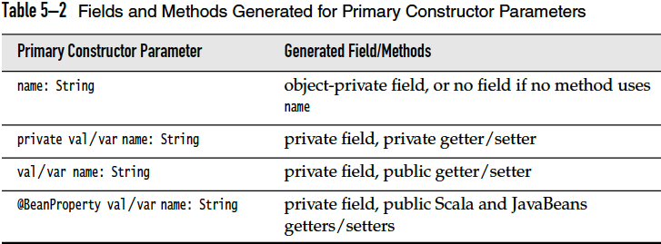

Compile and Run
===============

## REPL

**Kotlin**

    $ kotlinc-jvm -cp joda-time-2.9.4/joda-time-2.9.4.jar

**Ceylon**

    No support

**Groovy**

    $ groovysh

or GUI

    $ groovyConsole

**Scala**

    $ scala

## Scripting

**Kotlin**

    $ kotlinc -script <script_name> <parameters>

**Ceylon**

    No support

**Groovy**

    $ groovy <script>

## Compile and Run (without using Java directly)

**Kotlin**

    No support

**Ceylon**

    $ ceylon run --compile=force --run=hello default

or separatly in 2 steps:

    $ ceylon compile
    $ ceylon run --run=hello default    

## Running the program using plain Java

**Kotlin**

include run-time:

    $ kotlinc HelloWorld.kt -include-runtime -d HelloWorld.jar
    $ java -jar HelloWorld.jar

or without run-time:

    $ kotlinc HelloWorld.kt -d HelloWorld.jar
    $ java -cp $KOTLIN_HOME/lib/kotlin-runtime.jar:HelloWorld.jar HelloWorldKt

**Ceylon**

(run-time included or not?)

    $ ceylon fat-jar --run=hello default
    $ java -jar default.jar

## Compile to JavaScript


## Using Build tools


### Gradle

### Maven

## Using IDE


Basic syntax
============

## Package/Module/Namespace Definition

|               | Ceylon | Kotlin | Scala |
|---------------| ------ | ------ | ----- |
| Package       | No, using directory structure | package my.demo // at the top of the file | package pkg // at start of file <br/> package pkg { ... } |
| Imports       | | import foo.Bar <br/> import bar.Bar as bBar <br>import foo.* <br/> `import <other declarations>` <br> ~~import static~~ | |
| Visibility    | | // file name: example.kt <br> package foo <br> private fun foo() {} // visible inside example.kt <br> public var bar: Int = 5 // property is visible everywhere <br> private set // setter is visible only in example.kt <br> internal val baz = 6  // visible inside the same module | |

## Literals

<table>
  <thead>
    <tr>
      <th> </th>
      <th>Ceylon </th>
      <th>Kotlin </th>
      <th>Groovy </th>
      <th>Scala </th>
    </tr>
  </thead>
  <tbody>
    <tr>
      <th>String literals </th>
      <td title="Ceylon">&ldquo;Hello, <br/> World!&rdquo; </td>
      <td title="Kotlin">val string = &ldquo;string with \n new line&rdquo; </td>
      <td> </td>
      <td> </td>
    </tr>
    <tr>
      <th>Char encoding </th>
      <td>UTF-32</td>
      <td> </td>
      <td> </td>
      <td> </td>
    </tr>
    <tr>
      <th>Verbatim(raw) strings </th>
      <td title="Ceylon">&quot;&quot;&quot; &ldquo;Hello!&rdquo;, said the program. &quot;&quot;&quot;</td>
      <td title="Kotlin"><code class="Kotlin">val rawString = &ldquo;&ldquo;&ldquo;<br/>raw string is super useful for strings that span many lines &rdquo;&rdquo;&rdquo; </code></td>
      <td></td>
      <td><code class="Scala">raw&ldquo;&hellip;&rdquo;</code></td>
    </tr>
    <tr>
       <th> String interpolation(template)</th>
       <td title="Ceylon"> &rdquo;Hello, this is Ceylon <code>language.version</code> on <code>runtime.name</code> <code>runtime.version</code>!&ldquo; </td>
       <td title="Kotlin"> val s2 = &rdquo;${s1.replace(&ldquo;is&rdquo;, &ldquo;was&rdquo;)}, but now is $a&ldquo; </td>
       <td title="Groovy"></td>
       <td title="Scala"><pre><code class="Scala">f&ldquo;&hellip; $name&hellip;you&rsquo;ll be ${age + 0.5}%7.2f years old.%n&rdquo;
s&rdquo;&hellip;${exp}&hellip;&ldquo;</code></pre> 
       </td> 
    </tr>
    <tr>
      <th>Numbers </th>
      <td><code>Integer one = 1;</code><br/> <code>Float zero = 0.0;</code> </td>
      <td>123 //Default to Int<br/>123456L<br/>12.34 // Default to Double<br/>12.34F<br/>0xAB<br/>0b11010010_01101001<br/>//NO Octal literals<br/> </td>
      <td> </td>
      <td> </td>
    </tr>
    <tr>
      <th>Char </th>
      <td> </td>
      <td>&lsquo;1&rsquo;,\t, \b, \n, \r, &#39;, &quot;, \ and \$, &lsquo;\uFF00&rsquo;<br/> - Char is NOT a number <br/> - boxed when a nullable reference is needed </td>
      <td> </td>
      <td> </td>
    </tr>
    <tr>
      <th>Boolean </th>
      <td> </td>
      <td>true, false </td>
      <td> </td>
      <td> </td>
    </tr>
  </tbody>
</table>

## Comments, Case sensitivity, misc

|               | Ceylon | Kotlin | Groovy | Scala |
|---------------| ------ | ------ | ------ | ----- |
| Comment (Multiline) | ``/* The classic Hello World program */`` | ``/* This is a block comment on multiple lines. */``<br/> _Block comments can be nested_ | | |
| Comment (Single line)| //The classic Hello World program | // This is an end-of-line comment | | |
| Other comment | `doc` annotation for declarations, and may contain _Markdown_ formatting<br/> `doc` ("The classic Hello World program")<br/>`by` ("Trompon the Elephant")<br/> `see` (\`function goodbye\`)<br/>`throws` (\`class IOException\`)<br/>shared void hello() { ... }| | | |
| ; | Needed | Optional, needed only when multiple exp/statements are on the same line | | Optional, needed only when multiple exp/statements are on the same line |
| Case | Sensitive | Sensitive | Sensitive | Sensitive |

## Identifier naming

|               | Ceylon | Kotlin | Groovy | Scala |
|---------------| ------ | ------ | ------ | ----- |
| Type Name | **must** start with an initial capital letter| | | |
| Variable Name | **must** start with lowercase or underscore | | | |
| Function Name | **must** start with lowercase or underscore | | | |

## Variable declarations and primitive types

|               | Ceylon | Kotlin | Groovy | Scala |
|---------------| ------ | ------ | ------ | ----- |
| Variable declaration | String bye = "Adios"; //a value<br/>`variable` Integer count = 0;  //a variable<br/>String name { return firstName + " " + lastName; } | Mutable:<br/>`var` name = "kotlin"<br/>name = "more kotlin"<br/>Immutable:<br/>`val` name = "kotlin" |  |  val xmax, ymax = 100 <br> var greeting, message: String = null // greeting and message are both strings, initialized with null|
| Type inference | Yes | Yes | | Yes |
| Primitive types are Objects | Yes, will map basic types back to JVM primitives for performance reasons. |Yes, will map basic types back to JVM primitives for performance reasons.| |Yes, and even further: RichInt , RichDouble , RichChar , and so on |
| Boxing and Unboxing | | Boxing of numbers preserves equality but does not neccessarily preserve identity:<br/><code>val boxedA: Int? = a<br/>val anotherBoxedA: Int? = a<br/>print(boxedA === anotherBoxedA) //false<br/>print(boxedA == anotherBoxedA) // true </code>| | |
| Lazy Value | Yes | | | `lazy val words = scala.io.Source.fromFile("/usr/share/dict/words").mkString`|
| Numerical types | Integer(64), Float(64) |Double(64), Float(32), Long(64), Int(32), Short(16), Byte(8)| | Byte, Char, Short, Int, Long, Float, Double |
| (Explicit) Type conversion | NO explicit widening: 0.float // 'float' is an attribute | NOT implicitly converted to bigger types, Every number type supports the following conversions:<br/><ul><li><code>toByte(): Byte</code></li><li><code>toShort(): Short</code></li><li><code>toInt(): Int</code></li><li><code>toLong(): Long</code></li><li><code>toFloat(): Float</code></li><li><code>toDouble(): Double</code></li><li><code>toChar(): Char</code></li></ul> | | implicit coverted if defined <br> explicit conversion: <br> `<type>.apply(value)` or `<type>(value)` <br>  |
| String | | immutable,<br/> iterable: for(c in str) { println(c) }),<br/> indexable: s[i] | | |
| Nullable variable (Optional types) |String? name = process.arguments.first;|fun parseInt(str: String): Int? {...} | | |
| Handling Nullable values |String name = !arg.trimmed.empty `then` arg `else` "World";<br/>Integer length = name?.size else 0;| | | |

## Operators, Expression and Statement

|               | Ceylon | Kotlin | Groovy | Scala |
|---------------| ------ | ------ | ------ | ----- |
| operators are methods | | | | Yes |
| overloading operators | | | | Yes |
| Block expression | | | | The value of the block is the value of the last expression |

## Control Structures

<table>
              <thead>
                <tr>
                  <th> </th>
                  <th>Ceylon </th>
                  <th>Kotlin </th>
                  <th>Groovy </th>
                  <th>Scala </th>
                </tr>
              </thead>
              <tbody>
                <tr>
                  <td>braces </td>
                  <td><strong>CANNOT</strong> be omitted </td>
                  <td> </td>
                  <td> </td>
                  <td> </td>
                </tr>
                <tr>
                  <td>if&hellip;else </td>
                  <td>if(exp1) {&hellip;}<br/>else if(exp2) {&hellip;}<br/>else {&hellip;} </td>
                  <td>see <code>if</code> expression below </td>
                  <td> </td>
                  <td><code>if...else</code> expression </td>
                </tr>
                <tr>
                  <td>switch </td>
                  <td>NO fall-through behavior<br/>switch (exp)<br/>case (val1) {&hellip;}<br>case (val2) {&hellip;}<br/>else {&hellip;} </td>
                  <td>see <code>when</code> expression below </td>
                  <td> </td>
                  <td>No </td>
                </tr>
                <tr>
                  <td>Assert </td>
                  <td>&ldquo;customized assert msg&rdquo;<br/> assert(cond1, cond2,..) </td>
                  <td> </td>
                  <td> </td>
                  <td> </td>
                </tr>
                <tr>
                  <th>for loop</th>
                  <td title="Ceylon">
                    <code>for (var in <iterable> ) {&hellip;} else {&hellip;} </code><br/>
		    for (i in min:len) {&hellip;} <br/> 
		    for (i in min..max) {&hellip;} <br/> 
		    <strike> for (&hellip;;&hellip;;&hellip;)</strike> 
                  </td>
                  <td title="Kotlin">for (item in items) { println(item) } </td>
                  <td> </td>
                  <td title="Scala"><code> 
			for ( variable <- expression if cond) {&hellip;} <br>
			for ( var1 <- exp1; definition; var2 <- exp2; &hellip; ) {&hellip;} <br>
			for ( generator ) <code>yield</yield> expr // for comprehension <br>
			for { generator/cond/definition } {&hellip;} // braces OK </code>
		          </td>
                </tr>
                <tr>
                  <th>while </th>
                  <td>while (cond) {&hellip;} </td>
                  <td>while (index &lt; items.size) {<br/>println(&ldquo;item at $index is ${items[index]}&rdquo;)<br/>index++<br/>} </td>
                  <td></td>
                  <td></td>
                </tr>
                <tr>
                  <th>do&hellip;while </th>
                  <td>No </td>
                  <td>do { <br> val y = retrieveData() <br> } while (y != null) // y is visible here! </td>
                  <td> </td>
                  <td> </td>
                </tr>
                <tr>
                  <th>Exception(try/catch/finally)</th>
                  <td>like Java&rsquo;s but no checked exceptions </td>
                  <td> </td>
                  <td> </td>
                  <td title="Scala"> no “checked” exceptions, No try-with-resources 
                  <pre><code class="Scala">val url = new URL("http://horstmann.com/fred-tiny.gif")
try {
   process(url)
} catch {
   case _: MalformedURLException => println(s"Bad URL: $url")
   case ex: IOException => ex.printStackTrace()
} finally {
   url.close()
}</code></pre> A <code>throw</code> expression has the special type Nothing
                  </td>
                </tr>
                <tr>
                  <th>Condition lists </th>
                  <td>A condition list is simply an ordered list of :<br/> - <code>boolean</code> exp<br/> - <code>exists</code> conditions<br/> - <code>nonempty</code> conditions<br/> - <code>is</code> conditions<br/> - negated forms of the above<br/>Condition lists can be used in <code>if</code>, <code>switch</code>, <code>while</code>, <code>assert</code>, comprehensions, and <code>if and switch expressions</code> </td>
                  <td> </td>
                  <td> </td>
                  <td> </td>
                </tr>
                <tr>
                  <th>if, switch/when expressions </th>
                  <td>an &ldquo;inline&rdquo; if or switch within an expression, branches of an if or switch expression are always just expressions, never blocks of code! </td>
                  <td>fun maxOf(a: Int, b: Int) = <code>if (a &gt; b) a else b</code><br/>fun describe(obj: Any): String =<br/><code>when</code> (obj) {<br/>1 -&gt; &ldquo;One&rdquo;<br/>&ldquo;Hello&rdquo; -&gt;&ldquo;Greeting&rdquo;<br/>is Long -&gt; &ldquo;Long&rdquo;<br/>!is String -&gt; &ldquo;Not a string&rdquo;<br/>else -&gt; &ldquo;Unknown&rdquo;<br/>} </td>
                  <td> </td>
                  <td> </td>
                </tr>
                <tr>
                  <th>label </th>
                  <td> </td>
                  <td><code>label@</code> </td>
                  <td> </td>
                  <td> </td>
                </tr>
              </tbody>
</table>

## Function Declaration

<table>
  <thead>
    <tr>
      <th> </th>
      <th>Ceylon </th>
      <th>Kotlin </th>
      <th>Groovy </th>
      <th>Scala </th>
    </tr>
  </thead>
  <tbody>
    <tr>
      <th>Function declaration</th>
      <td title="Ceylon"> Float sqr(Float x) { return x * x; } </td>
      <td title="Kotlin">
        <code class="Kotlin">fun sum(a: Int, b: Int): Int { return a + b }</code> <br/>
        <code class="Kotlin">fun sum(a: Int, b: Int) <code>=</code> a + b //return type inferred</code><br/>
      </td>
      <td> </td>
      <td title="Scala">
    <pre>
<code class="Scala">def fac(n : Int) = {
    var r = 1
    for (i <- 1 to n) r = r * i
    r
}</code></pre>
        - return type can be inferred except for case of recursive functions <br>
        - return value is the last expr in the block  
     </td>
    </tr>
    <tr>
          <th>Void return value</th>
          <td title="Ceylon"> void hello(String name=&ldquo;World&rdquo;) {&hellip;} </td>
          <td title="Kotlin">  <code>Unit</code> : no return value and can be omitted </td>
          <td title="Groovy"></td>
          <td title="Scala">
            <pre><code class="Scala">def box(s : String): Unit = {
                 ...
}
def box(s : String) { // no <em>=</em>
    ...
}</code></pre>
          </td>
        </tr>
    <tr>
      <th>Default parameters</th>
      <td title="Ceylon"> void hello(String name=&ldquo;World&rdquo;) {&hellip;} </td>
      <td title="Kotlin"></td>
      <td title="Groovy"></td>
      <td title="Scala"></td>
    </tr>
    <tr>
      <th>Variadic parameters</th>
      <td title="Ceylon">void helloEveryone(String* names) {&hellip;} <br/> 
         void helloEveryone(String+ names) {&hellip;} //_nonempty_ variadic params
      </td>
      <td title="Kotlin"> </td>
      <td> </td>
      <td title="Scala"><pre><code class="Scala">def sum(args: Int*) = {
      var result = 0
      for (arg <- args) result += arg
      result
   }</code></pre>
    </td>
    </tr>
    <tr>
      <th>passing arguments to a variadic parameter</th>
      <td title="Ceylon">- provide an explicit list of enumerated arguments, <br/> - pass an iterable object producing the arguments<br/> - specify a comprehension.</td>
      <td> </td>
      <td> </td>
      <td title="Scala">
        <code>val s = sum(1 to 5: _*) // Consider 1 to 5 as an argument sequence</code>
      </td>
    </tr>
    <tr>
      <th>Lambda</th>
      <td title="Ceylon"><code>String name =&gt; firstName + &quot; &quot; + lastName;</code><br/><code>Float sqr(Float x) =&gt; x*x;</code></td>
      <td title="Kotlin"> -> </td>
      <td> </td>
      <td> </td>
    </tr>
  </tbody>
</table>

### Named arguments
**Ceylon**

Braces are used as delimiters instead of parentheses, arguments are separated by semicolons.

    printf {
        to = writer;
        format = "Thanks, %s. You have been charged %.2f. 
              Your confirmation number is %d.";
        values = { user.name, order.total, order.confimationNumber };
    };
    
or leave out the parameter name and the braces surrounding the iterable construction expression.

    printf {
        writer;
        "Thanks, %s. You have been charged %.2f. 
        Your confirmation number is %d.";
        user.name, order.total, order.confimationNumber
    };

**Kotlin**

**Scala**

## Class Definition

<table>
  <thead>
    <tr>
      <th></th>
      <th>Ceylon</th>
      <th>Kotlin</th>
      <th>Groovy</th>
      <th>Scala</th>
    </tr>
  </thead>
  <tbody>
    <tr>
      <th>Definition </th>
      <td title="Ceylon"><code>class</code> Polar(Float angle, Float radius) {…} </td>
      <td title="Kotlin">class Invoice {…} <br> class Empty </td>
      <td> </td>
      <td title="Scala"><pre><code class="Scala">class Counter {
    private var value = 0 // You must initialize the field
    def increment() { value += 1 } // Methods are public by default
    def current() = value
}</code></pre>* {} can be omitted if empty </td>
    </tr>
    <tr>
      <td>Member variables </td>
      <td>Attribute <br> Parameters of a class are accessible directly<br><code>shared</code> Polar rotate(Float rotation) =&gt; Polar(angle+rotation, radius); <br> class Polar(angle, radius) {<br>shared Float angle;<br>shared Float radius;<br> Or<br>class Polar(<code>shared</code> Float angle, <code>shared</code> Float radius) {… </td>
      <td>No field, only Properties </td>
      <td> </td>
      <td> </td>
    </tr>
    <tr>
      <td>Instantiation </td>
      <td>No <code>new</code> operator, just “invoke the class”<br><code>Polar(angle, radius)</code> or use <em>named parameters</em><br><code>Polar coord = Polar { radius = r; angle = theta; };</code> </td>
      <td>No <code>new</code> op, just call the constructor </td>
      <td> </td>
      <td title="Scala">val myCounter = <em>new</em> Counter // Or new Counter()<br>
        <em>Classname</em>(args) // calling companion obj's <em>apply</em> method
      </td>
    </tr>
    <tr>
      <td>Visibility </td>
      <td>By default, members are hidden from code outside the body of the class.<br>Annotated by the <code>shared</code> annotation, member is visible to any code.</td>
      <td>public by default. <br> - <code>private</code> visible inside this class only <br> - <code>rotected</code> — same as private + visible in subclasses <br> - <code>internal</code> — any client inside this module <br> - <code>public</code> any client who sees the declaring class sees. </td>
      <td> </td>
      <td> </td>
    </tr>
    <tr>
      <td>Overloading </td>
      <td><strong>No</strong> method or constructor overloading. Use defaulted, varargs, and union types or enumerated type constraints.</td>
      <td> </td>
      <td> </td>
      <td> </td>
    </tr>
    <tr>
      <td>Interface declaration </td>
      <td>interface Writer {…} </td>
      <td>interface Foo {…} </td>
      <td> </td>
      <td> </td>
    </tr>
    <tr>
      <td>Interface members </td>
      <td>concrete methods, attribute getters/setters, but NO references or init logic </td>
      <td>- abstract methods <br> - method implementation <br> - abstract props <br> - accessors </td>
      <td> </td>
      <td> </td>
    </tr>
    <tr>
      <td>Anonymous Class </td>
      <td><code>object</code> name extends … satisfies … {…} <br> Use \I_name_ to refer to the type </td>
      <td> </td>
      <td> </td>
      <td> </td>
    </tr>
    <tr>
      <td>object/Anonymous Class</td>
      <td title="Ceylon">- A toplevel object declaration does indeed define a singleton.<br>
      - when nested inside a class defines an object per instance of the containing class.<br>
      - nested inside a method, getter, or setter results in a new object each time the method, getter, or setter is executed.</td>
      <td> </td>
      <td> </td>
      <td title="Scala"><pre><code>object Accounts {
private var lastNumber = 0
def newUniqueNumber() = { lastNumber += 1; lastNumber }
}</code></pre> <li>An <em>object</em> can extend a class and/or traits</li>
        <li> <em>object</em>s returned by a function are different instances</li></td>
    </tr>
    <tr>
      <td>Member class </td>
      <td> </td>
      <td>Nested and Inner Classes </td>
      <td> </td>
      <td title="Scala">a member class is instance-specific, instance1.Member and instance2.Member are different classes.</td>
    </tr>
    <tr>
      <td>Abstract class </td>
      <td><code>abstract class</code> Point() {<br><code>shared formal</code> Polar polar;<br>…<br> } </td>
      <td><code>abstract class</code> Derived : Base() {<br><code>override abstract</code> fun f()<br>} </td>
      <td> </td>
      <td> </td>
    </tr>
    <tr>
      <td>static members </td>
      <td>barely used, use a toplevel function or value declaration </td>
      <td>do not have static methods, use package-level functions instead.</td>
      <td> </td>
      <td> </td>
    </tr>
    <tr>
      <td>companion obj </td>
      <td> </td>
      <td>declare a companion object inside your class, call its members using only the class name as a qualifier.</td>
      <td> </td>
      <td title="Scala"><pre><code class="Scala">class Account {
...
}
object Account { // The companion object
  private var lastNumber = 0
  private def newUniqueNumber() = { lastNumber += 1; lastNumber }
}</code></pre> * the class and its companion obj must be located in the same source file</td>
    </tr>
    <tr>
      <td>Type Alias </td>
      <td> </td>
      <td> </td>
      <td> </td>
      <td> </td>
    </tr>
  </tbody>
</table>

<div id="scala_primary_constructor_params">Scala Generated fields and methods for primary constructor parameters</div>


### Constructor

**Ceylon**

rarely needed, Parameters used to instantiate a class are right after the class name

**Kotlin**
      
<em>Primary constructor</em>:

```Kotlin
class Person constructor(firstName: String) {…}
class Person(firstName: String) {…}
class Customer public @Inject constructor(name: String) { … }
```    
The primary constructor cannot contain any code. Initialization code can be placed in initializer blocks

<em>Secondary constructor</em>:

```Kotlin
class Person(val name: String) {
    constructor(name: String, parent: Person) : this(name) {…} 
}
```
**Scala**

_Primary constructor_:

```Scala
class Person(val name: String, val age: Int) {
    println("Just constructed another person") // this line is part of primary constructor

    def description = s"$name is $age years old"
}
```

<em>Secondary constructors:</em>

```Scala
class Person {
    private var name = ""
    private var age = 0
    def this(name: String) { // An auxiliary constructor
        this() // Calls primary constructor
        this.name = name
    }
    def this(name: String, age: Int) { // Another auxiliary constructor
        this(name) // Calls previous auxiliary constructor
        this.age = age
    }
}
```    
You can often eliminate auxiliary constructors by using default arguments in the primary constructor:

    class Person(val name: String = "", val age: Int = 0)
See <a href="#scala_primary_constructor_params">Table</a>

 
### Properties

<table>
  <thead>
    <tr>
      <th> </th>
      <th>Ceylon </th>
      <th>Kotlin </th>
      <th>Groovy </th>
      <th>Scala </th>
    </tr>
  </thead>
  <tbody>
    <tr>
      <td>Property </td>
      <td>Attributes with getter/setter </td>
      <td> </td>
      <td> </td>
      <td> </td>
    </tr>
    <tr>
      <td>Property Init </td>
      <td>specify the value when declaring it or directly in the body of the class </td>
      <td>non-null properties must be initialized in the constructor, but <br><code>lateinit</code> var subject: TestSubject </td>
      <td> </td>
      <td> </td>
    </tr>
    <tr>
      <td>Getter and Setter </td>
      <td><code>shared</code> String fullName =&gt; … <br> <code>assign</code> fullName {…} </td>
      <td><code>var/val &lt;propName&gt;[: &lt;PropType&gt;] [=&lt;initializer&gt;]</code> <br> get() = … <br> set(value) {…} </td>
      <td> </td>
      <td title="Scala"><pre><code class="scala">...
private var privateAge = 0 // backing field
def age = privateAge
def age_=(newValue: Int) {
    privateAge = newValue; 
}
...</code></pre><em>@BeanProperty</em> val/var
name //Interop with JavaBeans<br> See <a href="#scala_generated_methods_for_fields">Table</a></td>
    </tr>
    <tr>
      <td>Backing field </td>
      <td> </td>
      <td>using the <code>field</code> identifier, generated if default implementation of accessors is used or <code>field</code> identifieris referenced </td>
      <td> </td>
      <td> </td>
    </tr>
    <tr>
      <th>object-private <br> vs.<br>class-private</th>
      <td></td>
      <td></td>
      <td></td>
      <td title="Scala"><code>private[this] var value = 0 //no getters and setters are generated </code></td>
    </tr>
  </tbody>
</table>

<div id="scala_generated_methods_for_fields"> - Scala generated methods for fields</div>  


### Extensions

|               | Ceylon | Kotlin | Swift  | Groovy | Scala  |
|---------------| ------ | ------ | ------ | ------ | ------ |
| Extension Function | | `fun <receiver type>.<function decl.> {...}` <br> - Extensions are resolved *statically* <br> - can be defined with a nullable receiver type | `extension` SomeType: Protocol1, Protocol2 {...} | | |
| Extension Property | | `val <receiver type>.<prop decl.>: <type> get() = ... set() = ...` <br> initializers are not allowed for extension properties. | | | |
| companion Obj Ext. | | fun MyClass.Companion.foo() { ... | | | |

## Inheritance and Overriding(refinement)

|               | Ceylon | Kotlin | Groovy | Scala |
|---------------| ------ | ------ | ------ | ----- |
| Common super class | | **Any** <br>equals(), hashCode() and toString()| | |
| Inherit a class | class LabeledPolar(Float angle, Float radius, String label)<br/>`extends` Polar(angle, radius) { | all classes in Kotlin are final by default<br>The open annotation allows others to inherit from this class.<br>`open` class Base(p: Int)<br>class Derived(p: Int) `:` Base(p)<br><br>interface members are 'open' by default | | |
| Overriding | shared `actual` String description => label + "-" + super.description;<br/>description => label + ": " + super.description;<br/>description = ...; | In super class: <br> `open` fun v() {} <br> In subclass: <br> `override` fun v() {}<br>A member marked override is itself open unless being `final`:<br>`final override` fun v() {}| | |
| Inherit an interface | `satisfies` interface1 & interface2| class C() : A(), B {<br> `override` fun bar() {...}<br>} | | |
| mixin inheritance | (super of Base).fun | `super<Base>` [code sample](#kotlin_mixin_sample) | | |

<h4 id="kotlin_mixin_sample">Kotlin mixin inheritance code sample</h4>
```Kotlin
open class A {
    open fun f() { print("A") }
    fun a() { print("a") }
}

interface B {
    fun f() { print("B") } // interface members are 'open' by default
    fun b() { print("b") }
}

class C() : A(), B {
    // The compiler requires f() to be overridden:
    override fun f() {
        super<A>.f() // call to A.f()
        super<B>.f() // call to B.f()
    }
}
```

## Type check and cast

|               | Ceylon | Kotlin | Swift  | Groovy | Scala  |
|---------------| ------ | ------ | ------ | ------ | ------ |
| Type check |`is`, `exist`, `nonempty`  | `is` operator checks and cast | | | |
| Type cast | `if (is ... )` tests and narrows the type to an intersection type | | | | |

## Collections

### Streams/Iterables

|               | Ceylon | Kotlin | Swift  | Groovy | Scala  |
|---------------| ------ | ------ | ------ | ------ | ------ |
| Literals and decl. | {String+} words = { "hello", "world" }; <br> {String+} moreWords = { "hola", "mundo", `*words` }; | | | | |
| Types | {X*} := `Iterable<X,Null>` <br> {X+} := `Iterable<X,Nothing>` | | | | |
| Containing test | `in` | | | | |
| Iterating | for (word in moreWords) {...} <br> for (i -> word in moreWords.indexed) {...} <br> for (name -> place in zipEntries(names,places)) {...} | | | | |
| Laziness | Yes, <br> - Elements are not evaluated until the stream is iterated, <br> - Each element is reevaluated each time the stream is iterated. <br> - Use _sequence_ [...] or `.follow()` for eagerly evaluation | | | | |
| value equality | == operator is not considered a well-defined operation for streams <br> use sequence [] or `set {...}` instead | | | | |

### Sequences/Arrays

|               | Ceylon | Kotlin | Swift  | Groovy | Scala  |
|---------------| ------ | ------ | ------ | ------ | ------ |
| Literals and decl. | `String[] operators = [ "+", "-", "*", "/" ];` <br> `[] none = []`   | | | | `val nums = new Array[Int](10)` <br> val s = Array("Hello", "World")|
| Types | [X*] or X[] := `Sequential<X>` <br> [X+] := `Sequence<X>` <br> [] := Empty | | | | |
| Immutable | Yes | | | | |
| Nullable Elements | YES, `return operators[i] else "";` | | | | |
| Containing test | `in` | | | | |
| Iterating | for (op in operators) {...} // operators.get(0) <br> String[] multiplicative = operators[2..3]; // operators.span(2,3)| | | | for ( v <- range ) {...}|
| Indexing | String? plus = operators[0];  | | | | s(0) |
| Comprehension | | | | | for (v <- Seq [if guard]) yield expr. | 
| Laziness | No, eagerly | | | | |
| value equality | Yes | | | | |
| Ranges | 'A'..'Z' := span('A', 'Z'); | | | |  start `to` end, start `until` end [`by` step]|
| Multidimentional Array | | | | |  `val matrix = Array.ofDim[Double](3, 4) // 3x4` <br> - ragged array possible |

### Tuples

|               | Ceylon | Kotlin | Swift  | Groovy | Scala  |
|---------------| ------ | ------ | ------ | ------ | ------ |
| Literals and decl. | [Float,Float,String] point = [0.0, 0.0, "origin"];  | | | |(1, 3.14, "Fred") |
| Types | `<tuple type> point = Tuple(0.0, Tuple(0.0, Tuple("origin", [])));` | | | |Tuple3[Int, Double, java.lang.String]<br>(Int, Double, java.lang.String)|
| Indexing | Float x = point[0]; <br> Float y = point[1]; <br> String label = point[2]; <br> Null zippo = point[3]; | | | | t._1, t._2, t._3 |
| Destructuring | `value [x, y, label] = point;` <br> `value [label, *point] = labeled; // labeled := ["one two three", 1.0, 2.0, 3.0]` <br> `for (i -> [en, es] in translations.indexed) {...}` | | | | `val (first, second, third) = t` <br> `val (first, second, _) = t` <br> `for ((s, n) <- pairs) print(s * n)` |
| Zipping | | | | | keys.zip(values).toMap |

* Tuple type name example: """ Tuple<Float|String,Float,Tuple<Float|String,Float,Tuple<String,String>>> """

### Hashtable/Maps

<table>
  <thead>
    <tr>
      <th> </th>
      <th>Ceylon</th>
      <th>Kotlin</th>
      <th>Swift</th>
      <th>Scala</th>
      <th>Groovy</th>
    </tr>
  </thead>
  <tbody>
    <tr>
      <th>Literals and decl.</th>
      <td title="Ceylon"></td>
      <td title="Kotlin"></td>
      <td title="Swift"></td>
      <td title="Scala"><code class="scala">val scores = Map("Alice" -> 10, "Bob" -> 3, "Cindy" -> 8)<br>
      val scores = Map(("Alice", 10), ("Bob", 3), ("Cindy", 8))<br></code> 
      Mutable map: <br> 
      <code class="scala">val scores = scala.collection.mutable.Map("Alice" -> 10, "Bob" -> 3, "Cindy" -> 8)<br>
      val scores = scala.collection.mutable.Map[String, Int]() // Blank map decl. needs type parameters</code>
      </td>
      <td title="Groovy"></td>
    <tr>
      <th>Accessing values</th>
      <td></td>
      <td></td>
      <td></td>
      <td title="Scala">
      <code>var scores = ... <br>scores("Bob")<br> scores += ("Bob" -> 10, "Fred" -> 7) <br> scores -= "Alice"</code>
      </td>
      <td></td>
    </tr>
    <tr>
    <th>Iterating</th>
    <td></td>
    <td></td>
    <td></td>
    <td title="Scala">for ((k, v) <- map) process k and v<br>for ((k, v) <- map) yield (v, k) // reverse the map</td>
    <td></td>
    </tr>
    <tr>
      <th>Keys/Values</th>
      <td></td>
      <td></td>
      <td></td>
      <td title="Scala">scores.keySet<br>scores.values // Iterable </td>
      <td></td>
    </tr>
    <tr>
      <th>Sorted Map</th>
      <td></td>
      <td></td>
      <td></td>
      <td title="Scala">scala.collection.mutable.SortedMap("Alice" -> 10, "Fred" -> 7, "Bob" -> 3, "Cindy" -> 8)</td>
      <td></td>
    </tr>
    <tr>
      <th>Linked Hash Map</th>
      <td></td>
      <td></td>
      <td></td>
      <td title="Scala">val months = scala.collection.mutable.LinkedHashMap("January" -> 1,
"February" -> 2, "March" -> 3, "April" -> 4, "May" -> 5, ...)</td>
      <td></td>
    </tr>
  </tbody>
</table>

Learning Tools
==============

## Playground/Worksheet 
1. Eclipse work script for Scala
2. IntelliJ Scala Worksheet

## Disassembler
1. [javap pastbin](https://javap.yawk.at) Java/Kotlin/Scala -> bytecode/procyon 

Frameworks
==========

|               | Ceylon | Kotlin | Groovy | Scala |
|---------------| ------ | ------ | ------ | ----- |
| Android       | Yes |Yes, official<br/> - [Anko](http://github.com/kotlin/anko)<br/> - [Kotlin Android Extensions](https://kotlinlang.org/docs/tutorials/android-plugin.html)| | |
| Spring        | | | | |
| Vert.x        | | | | |
| Javscript     | Yes | Yes, Web and Node.js  | | |
| Web           | | - [Ktor](https://github.com/kotlin/ktor) native Web framework built by JetBrains, coroutines<br/> - [kotlinx.html](https://github.com/kotlin/kotlinx.html) DSL to build HTML in a Web app. an alternative to JSP, and FreeMarker.| Grails | Play, Lift |
| Concurrency   | | | | Akka |


Cloud Platforms
===============

|               | Ceylon | Kotlin | Groovy | Scala |
|---------------| ------ | ------ | ------ | ----- |
| Amazon Web Services | | Yes | | |
| Google Cloud Platform | | Yes | | |
| Heroku | | Yes | | |
| Microsoft Azue | | | |

Products and Projects
=====================

## Celyon

## Kotlin

1. [Corda](https://www.corda.net/2017/01/10/kotlin/)
   an open-source distributed ledger platform, supported by major banks, and built entirely in Kotlin.
2. [Kobalt](http://beust.com/kobalt)
   a build system inspired by Gradle and Maven.
